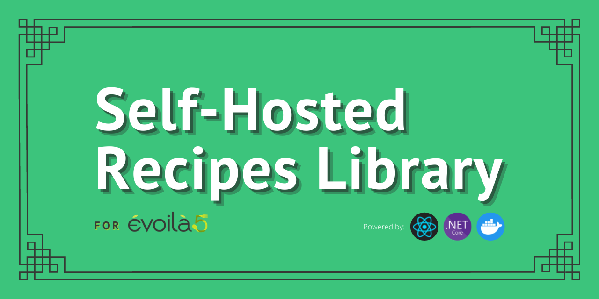

# Recipes Library



## Table of content

1. [Initial Setup](#initial-setup)
2. [Starting the app](#starting-the-app)
   - [Dev](#dev)
   - [Prod](#prod)
3. [Backup and Restore](#backup-and-restore)

## Initial Setup

Create file `/web-app/.env` based on `/web-app/.env.template` and put machine local ip in variable.

Create both `docker-compose.yml` file based on their respective templates, one at root (prod) and one at `/API` (for dev).

In these docker-compose files, for the api service, change the `WEB_APP_ADDR` environment variable and the volume path to fit your system.

## Starting the app

### Dev

In `/web-app`, run both commands `npm i` and `npm run dev`.

Start the api and database with the `docker-compose.yml` file in `/API`. It is recommended to do this from Visual Studio, put `docker-compose` as starting project then debug.

### Prod

Lauch everything through docker compose with the `docker-compose.yml` file located at root.

Simply run the command :

```
docker-compose up --build [-d] (detached mode)
```

If the compose was started in detached mode (nothing shown in cmd), stop the containers with :

```
docker-compose stop
```

## Backup and Restore

While the application is running, you can create a backup (database + pictures). Simply run the PowerShell script:

```
SqlDump.ps1
```

Specify the backup output folder, and if the application is running in dev mode or not.

You can also restore the system from a backup point with the PowerShell script

```
SqlRestore.ps1
```

Specify the backup input folder, and if the application is running in dev mode or not.
